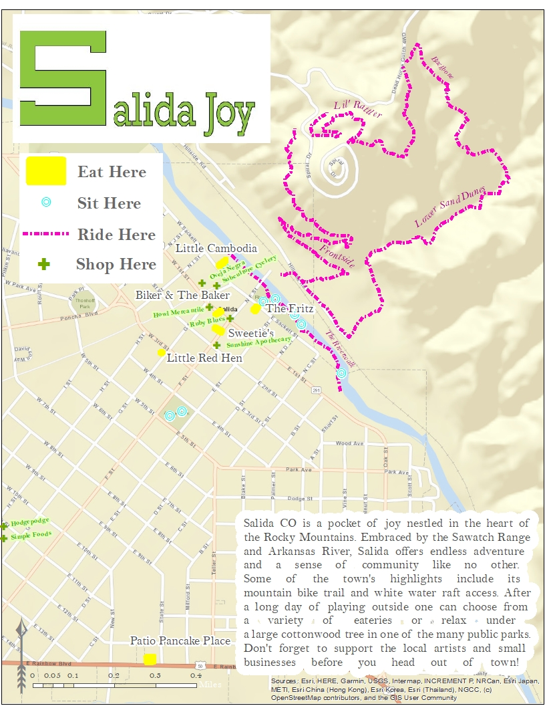

# Caitlin McCarthy's GIS Portfolio
I am a Natural Resource Management student at Colorado Mountain College in Leadville This is a collection of my work completed while earning my Advanced GIS Certicicate.
## My Salida Joy Project
This map was made during a lab assignment for my GPS for GIS class in 2020. The assignment was to map out one of our favorite places and to showcase what makes it so great using original point, polygon, and line data collected through a Trimble device. I chose to map out the lovely town of Salida, CO. This map features local shops and restaurants, a few mountain bike trails, and some of my favorite spots to sit, relax, read, and people watch. This map also features a graphic that I created in Adobe Illustrator. The "S" in Salida reflects the "S" emblazed on Salida's Tenderfoot Mountain.

